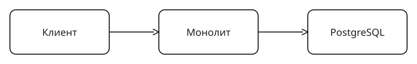

# Пример занятия

Каталог показывает форму и в занятиях не используется. Заводя новое занятие, скопируйте его целиком и перепишите этот файл.

## Кейс

Сервис такси работает монолитом, PostgreSQL стоит на отдельной машине. На занятии проходим путь заказа от клиента до записи в базу и ищем, где он упирается.

## Доска

Файл _board.excalidraw.svg_ несёт сцену внутри себя. Перетащите его на [excalidraw.com](https://excalidraw.com), чтобы продолжить рисовать.
